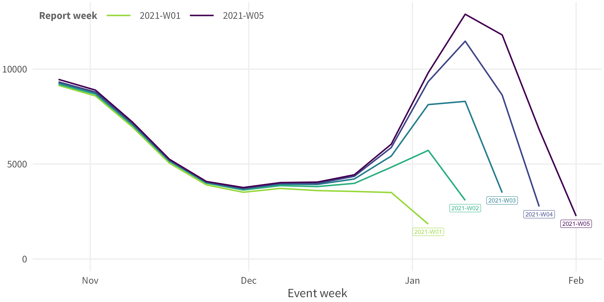
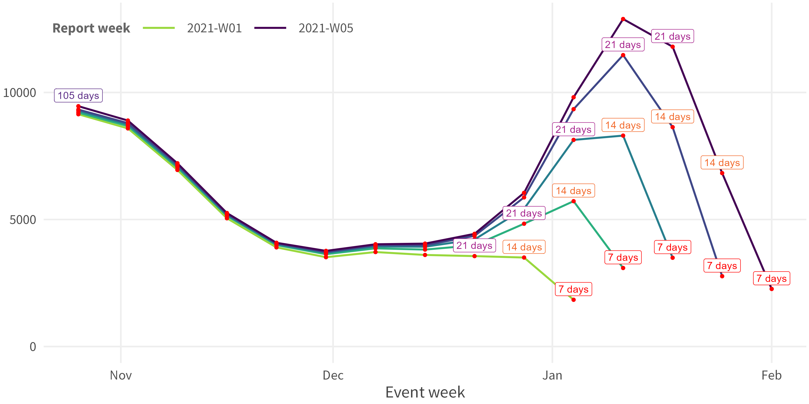
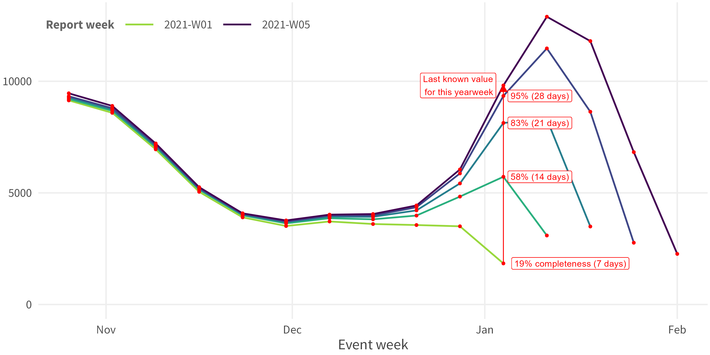
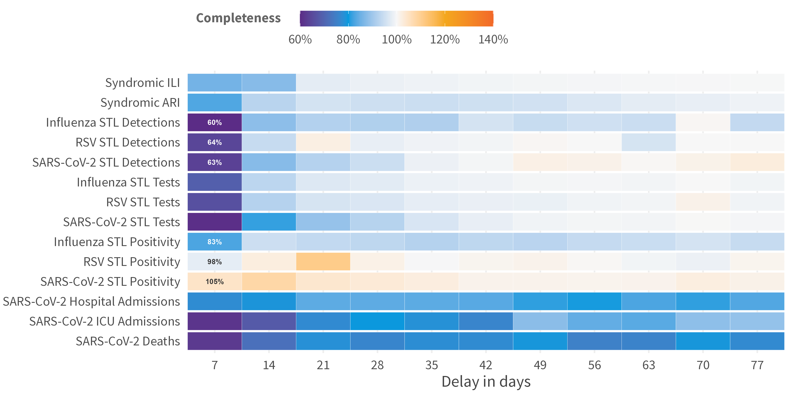
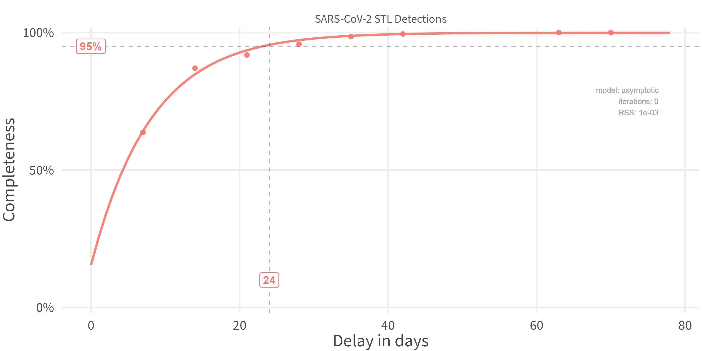
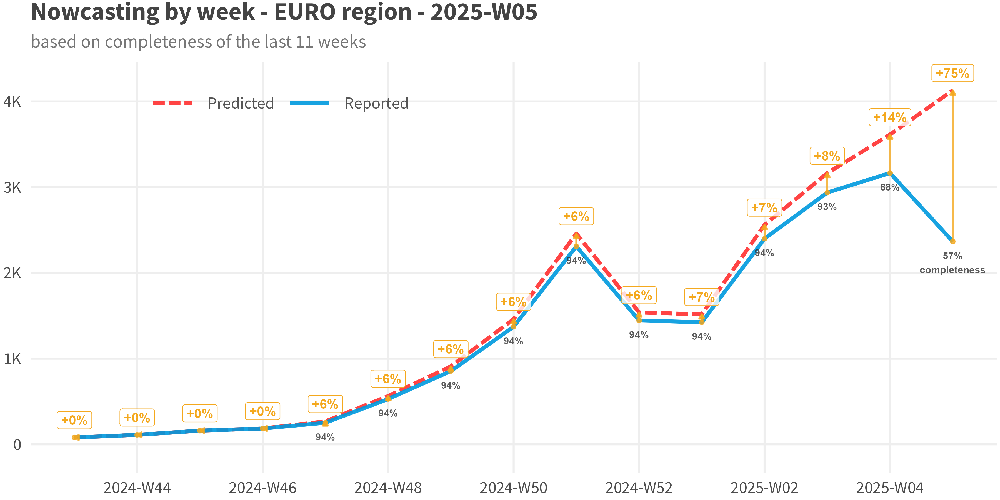

# nowcastr

[](https://lifecycle.r-lib.org/articles/stages.html#experimental)
[](https://opensource.org/licenses/MIT)
[](https://www.r-project.org/)


R package for nowcasting with non-cumulative chain-ladder method.  

- 1 main nowcast function
  - `nowcast_cl()` returns object with all intermediary results
- 4 plots
  - `plot_nc_input(option = "triangle")` / `plot(which = "data", option = "triangle")`
  - `plot_nc_input(option = "millipede")` / `plot(which = "data", option = "millipede")`
  - `plot_delays()` / `plot(which = "delays")`
  - `plot_nowcast()` / `plot(which = "results")`
- 3 utility functions
  - `calculate_retro_score()`: Calculate retro-scores for all groups
  - `rm_repeated_values()`: Remove duplicated reported values in reporting matrix
  - `fill_future_reported_values()`: Fill future reported values with last known values


## Installation

<!-- ``` r
install.packages("nowcastr")
``` -->

``` r
pak::pak("whocov/nowcastr")
```


## Quick Start


```r
library(nowcastr)

# Run nowcast with built-in demo data
result <- nowcast_demo %>% 
  nowcast_cl(
    col_date_occurrence = date_occurrence,
    col_date_reporting = date_report,
    col_value = value,
    group_cols = "group"
  )

# View results
print(result@results)
plot(result, which = "results")
```


## Data Requirements

Dataset with at least 2 date columns and a value column. The dataset can also have multiple group-by columns for batch processing.

Note that the delays (difference between the 2 dates) should have constant intervals, *i.e.*, multiples of 1 day or 7 days.

``` r
print(nowcast_demo)

# # A tibble: 1,624 × 4
#     value date_occurrence date_report group        
#     <dbl> <date>         <date>      <chr>
#  1 251563 2024-12-16     2025-05-26  Syndromic ARI
#  2 219818 2024-12-23     2025-05-26  Syndromic ARI
#  3 219815 2024-12-23     2025-06-02  Syndromic ARI
#  4 253451 2024-12-30     2025-05-26  Syndromic ARI
#  5 253454 2024-12-30     2025-06-09  Syndromic ARI
#  6 311660 2025-01-06     2025-05-26  Syndromic ARI
#  7 311666 2025-01-06     2025-06-02  Syndromic ARI
#  8 311654 2025-01-06     2025-06-09  Syndromic ARI
#  9 311657 2025-01-06     2025-06-16  Syndromic ARI
# 10 313798 2025-01-13     2025-05-26  Syndromic ARI
# # ℹ 1,614 more rows
```

## Usage


### Data Preparation

``` r
## Visualize input data
nowcast_demo %>%
  plot_nc_input(
    option = "triangle",
    col_date_occurrence = date_occurrence,
    col_date_reporting = date_report,
    col_value = value,
    group_cols = "group"
  )

## Fill the missing (optional)
data <-
  nowcast_demo %>%
  fill_future_reported_values(
    col_date_occurrence = date_occurrence,
    col_date_reporting = date_report,
    col_value = value,
    group_cols = "group",
    max_delay = "auto"
  )

## Visualize the change
data %>%
  plot_nc_input(
    option = "triangle",
    col_date_occurrence = date_occurrence,
    col_date_reporting = date_report,
    col_value = value,
    group_cols = "group"
  )
```

### Nowcast

``` r
nowcast <- data %>%
  nowcast_cl(
    col_date_occurrence = date_occurrence,
    col_date_reporting = date_report,
    col_value = value,
    group_cols = "group",
    time_units = "weeks",
    do_model_fitting = TRUE,
  )
```


### Plotting Results

``` r
print(nowcast@delays)
nowcast %>% plot(which = "delays")
```

``` r
print(nowcast@results)
nowcast %>% plot(which = "results")
```


## Output Object

`nowcast_cl()` returns an S7 object of class `nowcast_results` with the following properties:

| Property | Type | Description |
|----------|------|-------------|
| `name` | character | Timestamp identifier for the run |
| `params` | list | Parameters used for nowcasting (unevaluated call) |
| `time_start` | POSIXct | Sys time when function started |
| `time_end` | POSIXct | Sys time when function ended |
| `n_groups` | numeric | Number of groups processed |
| `max_delay` | numeric | Maximum delay used |
| `data` | data.frame | Original input data (required columns only) |
| `completeness` | data.frame | Input data with delays and completeness columns |
| `delays` | data.frame | Aggregated completeness per delay (+ `modelled` column if fitted) |
| `models` | data.frame | Fitted models (empty if `do_model_fitting = FALSE`) |
| `results` | data.frame | Final nowcasting predictions |

Access properties with `$`:

```r
nowcast$delays
nowcast$results
nowcast$params
```

Available methods:
- `print(nowcast)` - Summary of nowcast results
- `plot(nowcast, which = "delays")` - Delay distribution
- `plot(nowcast, which = "results")` - Nowcast time series


## Methods

Summary:  

<ol>

<li>Input Data: Ensure three core columns: `observed_value` / `date_of_reporting` / `date_of_occurrence` (e.g. date_of_event / date_of_onset)
</li>

<li>Calculate the `reporting_delay` (= `date_of_reporting` - `date_of_occurrence`)
</li>

<li>Compute the `completeness` (= `observed_value` / `true_value` (approximated by `last_reported_value`))
</li>

<li>Aggregate the `avg_completeness` for each `reporting_delay`
</li>

<li>Optional: Fit a curve through that
</li>

<li>Apply Nowcast: `nowcast` = `observed_value` / `avg_completeness`
</li>

</ol>