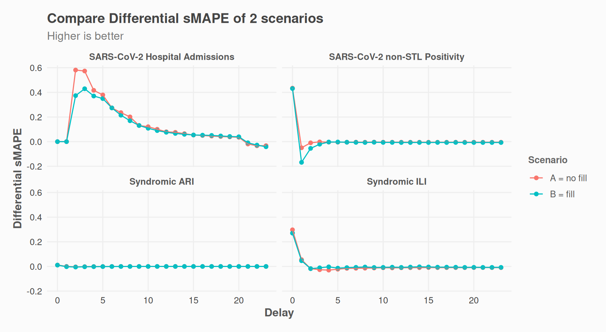

# Evaluate accuracy

To evaluate model accuracy,
[`nowcast_eval()`](https://whocov.github.io/nowcastr/reference/nowcast_eval.md)
performs historical backtesting. It iteratively applies
[`nowcast_cl()`](https://whocov.github.io/nowcastr/reference/nowcast_cl.md)
to past dates, censoring data that would have been unavailable at each
point in time. By comparing these predicted values against the observed
values (the raw data available at the time), we can quantify the model’s
added value.

We use two indicators:

- **Win Rate**: The frequency with which the model’s absolute error is
  lower than the observation’s absolute error. A value **\>50%**
  suggests the nowcast is more reliable than the raw data.

- **Differential sMAPE ($\Delta\text{sMAPE}$)**:

  $$\Delta\text{sMAPE} = \text{sMAPE}_{\text{obs}} - \text{sMAPE}_{\text{pred}}$$

  This measures the average reduction in symmetric error. A **positive
  value** indicates the model improves accuracy over the initial report,
  while a **negative value** suggests the raw data was already more
  accurate.

## Run evaluation

You can run the evaluation with all the same parameters as
[`nowcast_cl()`](https://whocov.github.io/nowcastr/reference/nowcast_cl.md).  
[`nowcast_eval()`](https://whocov.github.io/nowcastr/reference/nowcast_eval.md)
has only one additional parameter: `n_past`, which controls how many
steps in the past you wish to run a nowcast on.

``` r
library(nowcastr)
nc_eval_obj <-
  nowcast_demo %>%
  nowcast_eval(
    n_past = 10,
    col_date_occurrence = date_occurrence,
    col_date_reporting = date_report,
    col_value = value,
    group_cols = "group",
    time_units = "weeks",
    do_model_fitting = TRUE
  )
#> Evaluating nowcast  ■■■■■■■■■■■■■                    4/10 | ETA:  2s
#> Evaluating nowcast  ■■■■■■■■■■■■■■■■■■■■■■■■■■■■     9/10 | ETA:  0s
#> Evaluating nowcast  ■■■■■■■■■■■■■■■■■■■■■■■■■■■■■■■  10/10 | ETA:  0s
```

This will return an S7 object with 2 slots for 2 datasets.

- `nc_eval_obj@detail` contains detailed results, and  
- `nc_eval_obj@summary` is summarised by `group_cols` and `delay`.

``` r
nc_eval_obj@detail
#> # A tibble: 958 × 12
#>    group cut_date   date_occurrence last_r_date value value_predicted value_true
#>    <chr> <date>     <date>          <date>      <dbl>           <dbl>      <dbl>
#>  1 SARS… 2025-09-08 2025-03-31      2025-09-08     19            19.4         19
#>  2 SARS… 2025-09-08 2025-04-07      2025-09-08     26            26.7         27
#>  3 SARS… 2025-09-15 2025-04-07      2025-09-15     27            29.0         27
#>  4 SARS… 2025-09-08 2025-04-14      2025-09-08     21            21.8         21
#>  5 SARS… 2025-09-15 2025-04-14      2025-09-15     21            22.6         21
#>  6 SARS… 2025-09-22 2025-04-14      2025-09-22     21            22.6         21
#>  7 SARS… 2025-09-08 2025-04-21      2025-09-08     29            30.4         32
#>  8 SARS… 2025-09-15 2025-04-21      2025-09-15     28            30.2         32
#>  9 SARS… 2025-09-22 2025-04-21      2025-09-22     30            32.3         32
#> 10 SARS… 2025-09-29 2025-04-21      2025-09-29     32            34.4         32
#> # ℹ 948 more rows
#> # ℹ 5 more variables: delay <dbl>, SAPE_pred <dbl>, SAPE_obs <dbl>,
#> #   SAPE_improvement <dbl>, isWin <int>
nc_eval_obj@summary
#> # A tibble: 96 × 10
#>    group        delay n_periods n_obs smape_diff_med smape_diff_q1 smape_diff_q3
#>    <chr>        <dbl>     <int> <int>          <dbl>         <dbl>         <dbl>
#>  1 SARS-CoV-2 …     0        10    10          0             0             0    
#>  2 SARS-CoV-2 …     1        10    10          0             0             0.217
#>  3 SARS-CoV-2 …     2        10    10          0.581         0.303         0.664
#>  4 SARS-CoV-2 …     3        10    10          0.573         0.253         0.647
#>  5 SARS-CoV-2 …     4        10    10          0.416         0.243         0.467
#>  6 SARS-CoV-2 …     5        10    10          0.379         0.247         0.428
#>  7 SARS-CoV-2 …     6        10    10          0.274         0.233         0.300
#>  8 SARS-CoV-2 …     7        10    10          0.236         0.192         0.237
#>  9 SARS-CoV-2 …     8        10    10          0.201         0.154         0.203
#> 10 SARS-CoV-2 …     9        10    10          0.131         0.124         0.144
#> # ℹ 86 more rows
#> # ℹ 3 more variables: winrate <dbl>, winrate_low <dbl>, winrate_high <dbl>
```

## Plots

### Plot aggregated indicators

``` r
plot_nowcast_eval(nc_eval_obj, delay = 0)
```


### Plot one indicator by delay

``` r
plot_nowcast_eval_by_delay(nc_eval_obj, indicator = "smape_diff_med")
```


### Plot raw values, for one delay

- predicted values
- observed values (i.e. reported at the time)
- last reported values (ground truth)

``` r
plot_nowcast_eval_detail(nc_eval_obj, delay = 0)
```


## Evaluate Scenarios

We can test if accuracy of nowcasts improve with or without
[`fill_future_reported_values()`](https://whocov.github.io/nowcastr/reference/fill_future_reported_values.md):

``` r
nc_eval_obj_with_fill <-
  nowcast_demo %>%
  fill_future_reported_values(
    col_date_occurrence = date_occurrence,
    col_date_reporting = date_report,
    col_value = value,
    group_cols = "group",
    max_delay = "auto"
  ) %>%
  nowcast_eval(
    n_past = 10,
    col_date_occurrence = date_occurrence,
    col_date_reporting = date_report,
    col_value = value,
    group_cols = "group",
    time_units = "weeks",
    do_model_fitting = TRUE
  )
```

``` r
library(dplyr)
indicator <- "smape_diff_med"

scenario_a <- nc_eval_obj@summary %>%
  dplyr::select("group", "delay", "smape_diff_med") %>%
  dplyr::mutate(scenario = "A = no fill")

scenario_b <- nc_eval_obj_with_fill@summary %>%
  dplyr::select("group", "delay", "smape_diff_med") %>%
  dplyr::mutate(scenario = "B = fill")

## quick mean of everything
dplyr::bind_rows(scenario_a, scenario_b) %>%
  dplyr::filter(delay <= 3) %>% ## predictions for older data are not that interesting
  dplyr::summarise(
    .by = c(scenario),
    avg_smape_diff_med = mean(smape_diff_med, na.rm = T)
  ) %>%
  dplyr::mutate(tag = dplyr::if_else(avg_smape_diff_med == max(avg_smape_diff_med), "better", "worse")) %>%
  print()
#> # A tibble: 2 × 3
#>   scenario    avg_smape_diff_med tag   
#>   <chr>                    <dbl> <chr> 
#> 1 A = no fill             0.115  better
#> 2 B = fill                0.0799 worse
```

``` r
## Comparison plot
library(ggplot2)
dplyr::bind_rows(scenario_a, scenario_b) %>%
  dplyr::summarise(
    .by = c(delay, scenario, group),
    smape_diff_med = mean(smape_diff_med, na.rm = T)
  ) %>%
  ggplot(aes(x = delay, y = smape_diff_med, color = scenario)) +
  geom_point() +
  geom_line() +
  facet_wrap(~group) +
  # ggplot2::scale_y_continuous(labels = scales::label_percent()) +
  theme_nowcastr() +
  labs(
    y = "Differential sMAPE",
    x = "Delay",
    color = "Scenario",
    title = "Compare Differential sMAPE of 2 scenarios",
    subtitle = "Higher is better"
  )
```


