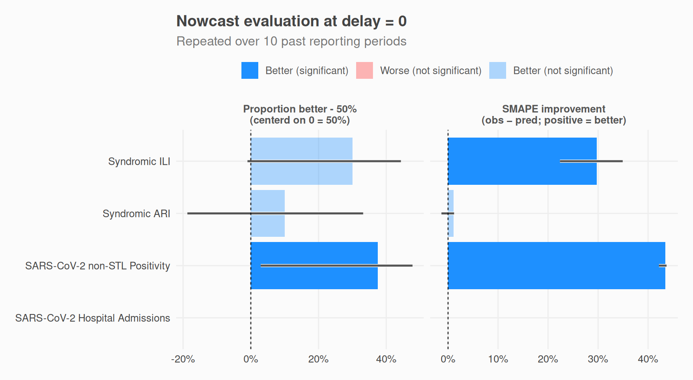
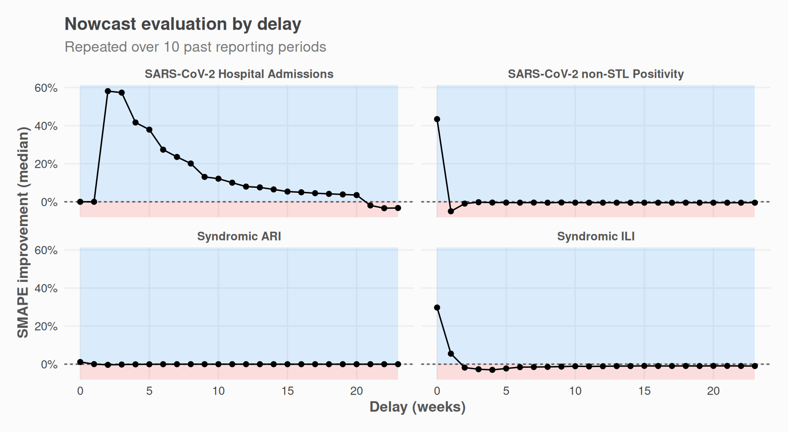
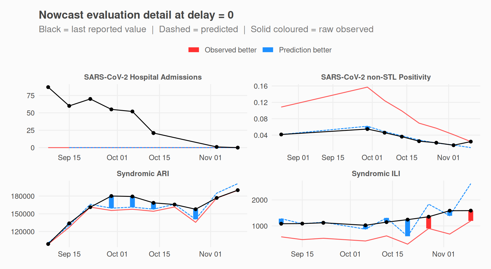

# Evaluate accuracy

To evaluate the accuracy of the model, we can measure whether the
nowcasted values outperformed the reported values in the past.
[`nowcast_eval()`](https://whocov.github.io/nowcastr/reference/nowcast_eval.md)
does this by running
[`nowcast_cl()`](https://whocov.github.io/nowcastr/reference/nowcast_cl.md)
multiple times on past data, each time truncating the knowledge horizon
so that only data available at that point in time is used.

## Run evaluation

You can run the evaluation with all the same parameters as
[`nowcast_cl()`](https://whocov.github.io/nowcastr/reference/nowcast_cl.md).  
[`nowcast_eval()`](https://whocov.github.io/nowcastr/reference/nowcast_eval.md)
has only one additional parameter: `n_past`, which controls how many
steps in the past you wish to run a nowcast on.

``` r
library(nowcastr)
nc_eval_obj <-
  nowcast_demo %>%
  nowcast_eval(
    n_past = 10,
    col_date_occurrence = date_occurrence,
    col_date_reporting = date_report,
    col_value = value,
    group_cols = "group",
    time_units = "weeks",
    do_model_fitting = TRUE
  )
#> Evaluating nowcast  ■■■■■■■■■■■■■                    4/10 | ETA:  2s
#> Evaluating nowcast  ■■■■■■■■■■■■■■■■■■■■■■■■■        8/10 | ETA:  1s
#> Evaluating nowcast  ■■■■■■■■■■■■■■■■■■■■■■■■■■■■■■■  10/10 | ETA:  0s
```

This will return an S7 object with 2 slots for 2 datasets.

- `nc_eval_obj@detail` contains detailed results, and  
- `nc_eval_obj@summary` is summarised by `group_cols` and `delay`.

``` r
nc_eval_obj@detail
#> # A tibble: 958 × 12
#>    group cut_date   date_occurrence last_r_date value value_predicted value_true
#>    <chr> <date>     <date>          <date>      <dbl>           <dbl>      <dbl>
#>  1 SARS… 2025-09-08 2025-03-31      2025-09-08     19            19.4         19
#>  2 SARS… 2025-09-08 2025-04-07      2025-09-08     26            26.7         27
#>  3 SARS… 2025-09-15 2025-04-07      2025-09-15     27            29.0         27
#>  4 SARS… 2025-09-08 2025-04-14      2025-09-08     21            21.8         21
#>  5 SARS… 2025-09-15 2025-04-14      2025-09-15     21            22.6         21
#>  6 SARS… 2025-09-22 2025-04-14      2025-09-22     21            22.6         21
#>  7 SARS… 2025-09-08 2025-04-21      2025-09-08     29            30.4         32
#>  8 SARS… 2025-09-15 2025-04-21      2025-09-15     28            30.2         32
#>  9 SARS… 2025-09-22 2025-04-21      2025-09-22     30            32.3         32
#> 10 SARS… 2025-09-29 2025-04-21      2025-09-29     32            34.4         32
#> # ℹ 948 more rows
#> # ℹ 5 more variables: delay <dbl>, SAPE_pred <dbl>, SAPE_obs <dbl>,
#> #   SAPE_improvement <dbl>, pred_is_better <int>
nc_eval_obj@summary
#> # A tibble: 96 × 14
#>    group       delay n_periods n_obs SMAPE_pred SMAPE_obs SMAPE_improvement_mean
#>    <chr>       <dbl>     <int> <int>      <dbl>     <dbl>                  <dbl>
#>  1 SARS-CoV-2…     0        10    10     1          1                     0     
#>  2 SARS-CoV-2…     1        10    10     0.806      0.992                 0.186 
#>  3 SARS-CoV-2…     2        10    10     0.364      0.799                 0.435 
#>  4 SARS-CoV-2…     3        10    10     0.274      0.665                 0.391 
#>  5 SARS-CoV-2…     4        10    10     0.227      0.525                 0.297 
#>  6 SARS-CoV-2…     5        10    10     0.164      0.444                 0.280 
#>  7 SARS-CoV-2…     6        10    10     0.115      0.320                 0.205 
#>  8 SARS-CoV-2…     7        10    10     0.0964     0.256                 0.160 
#>  9 SARS-CoV-2…     8        10    10     0.0736     0.204                 0.130 
#> 10 SARS-CoV-2…     9        10    10     0.0705     0.169                 0.0986
#> # ℹ 86 more rows
#> # ℹ 7 more variables: SMAPE_improvement_med <dbl>, SMAPE_improvement_q1 <dbl>,
#> #   SMAPE_improvement_q3 <dbl>, proportion_pred_is_better <dbl>, n_pairs <int>,
#> #   CI_lower <dbl>, CI_upper <dbl>
```

## Plots

### Plot aggregated indicators

- “SMAPE Improvement median” = median of the difference between
  SMAPE(observed) and SMAPE(predicted)
- “Proportion Better = proportion of predictions that outperform base
  values (-50% to center around zero)

``` r
plot_nowcast_eval(nc_eval_obj, delay = 0)
```



### Plot one indicator by delay / for one indicator

``` r
plot_nowcast_eval_by_delay(nc_eval_obj, indicator = "SMAPE_improvement_med")
```



### Plot raw values / for one delay

- predicted values
- base reported values, at the time
- last reported values

``` r
plot_nowcast_eval_detail(nc_eval_obj, delay = 0)
```



## Evaluate Scenarios

We can test if accuracy of nowcasts improve with or without
[`fill_future_reported_values()`](https://whocov.github.io/nowcastr/reference/fill_future_reported_values.md):

``` r
nc_eval_obj_with_fill <-
  nowcast_demo %>%
  fill_future_reported_values(
    col_date_occurrence = date_occurrence,
    col_date_reporting = date_report,
    col_value = value,
    group_cols = "group",
    max_delay = "auto"
  ) %>%
  nowcast_eval(
    n_past = 10,
    col_date_occurrence = date_occurrence,
    col_date_reporting = date_report,
    col_value = value,
    group_cols = "group",
    time_units = "weeks",
    do_model_fitting = TRUE
  )

# plot_nowcast_eval(nc_eval_obj_with_fill, delay = 0)
```

``` r
library(dplyr)

# indicator <- "proportion_pred_is_better"
indicator <- "SMAPE_improvement_mean"

scenario_a <- nc_eval_obj@summary %>%
  dplyr::select("group", "delay", ind = all_of(indicator)) %>%
  mutate(scenario = "A = no fill")

scenario_b <- nc_eval_obj_with_fill@summary %>%
  dplyr::select("group", "delay", ind = all_of(indicator)) %>%
  mutate(scenario = "B = fill")

## quick mean of everything
dplyr::bind_rows(scenario_a, scenario_b) %>%
  filter(delay <= 3) %>% ## predictions for older data are not that interesting
  dplyr::summarise(
    .by = c(scenario),
    ind = mean(ind, na.rm = T)
  ) %>%
  mutate(tag = if_else(ind == max(ind), "better", "worse")) %>%
  print()
#> # A tibble: 2 × 3
#>   scenario       ind tag   
#>   <chr>        <dbl> <chr> 
#> 1 A = no fill 0.0971 better
#> 2 B = fill    0.0767 worse
```

``` r

## Example comparison plot
library(ggplot2)
dplyr::bind_rows(scenario_a, scenario_b) %>%
  dplyr::summarise(
    .by = c(delay, scenario, group),
    ind = mean(ind, na.rm = T)
  ) %>%
  ggplot(aes(x = delay, y = ind, color = scenario)) +
  geom_point() +
  geom_line() +
  facet_wrap(~group) +
  # ggplot2::scale_y_continuous(
  #   labels = scales::label_percent()
  # ) +
  theme_nowcastr(20) +
  labs(
    y = "Mean SMAPE improvement", x = "Delay",
    color = "Scenario",
    title = "Compare accuracy of 2 scenarios",
    subtitle = "Higher is better"
  )
```
