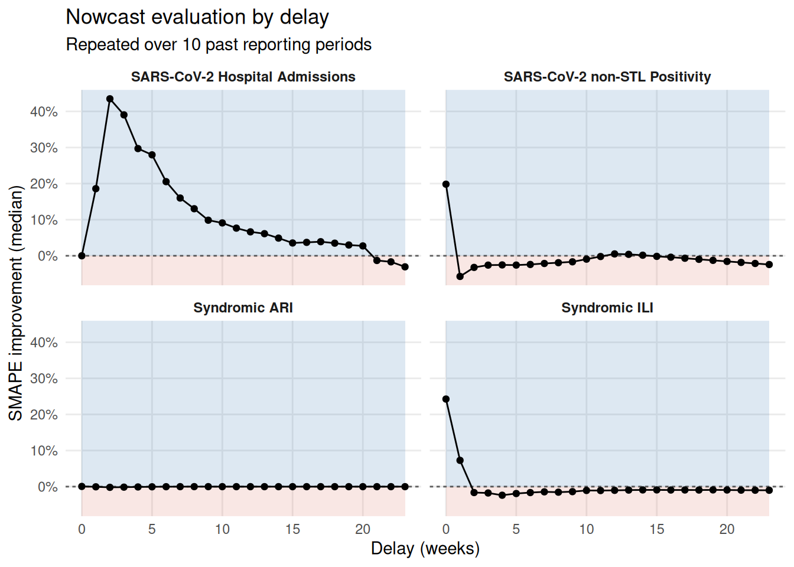
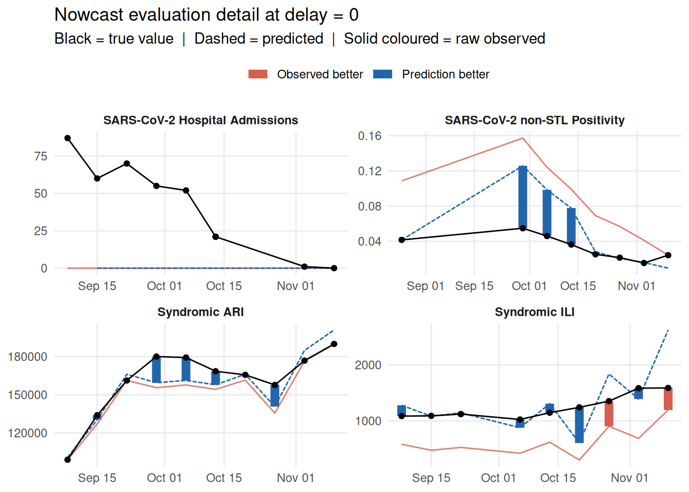
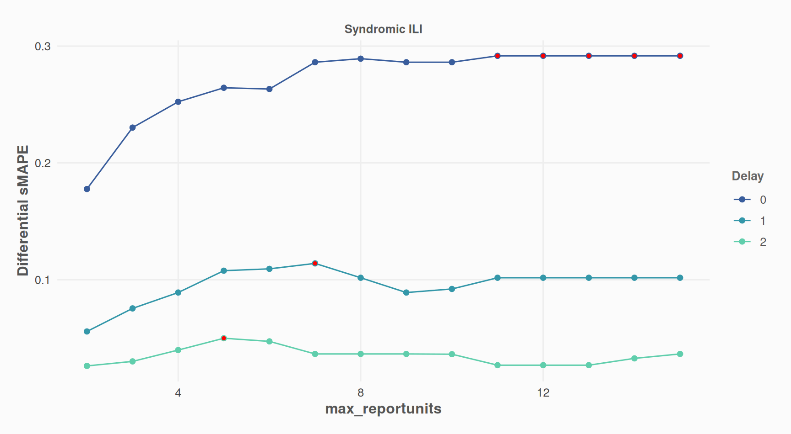

# Evaluate Past Nowcasts Accuracy

## Run evaluation

You can run the evaluation with all the same parameters as
[`nowcast_cl()`](https://whocov.github.io/nowcastr/reference/nowcast_cl.md).  
[`nowcast_eval()`](https://whocov.github.io/nowcastr/reference/nowcast_eval.md)
has only one additional parameter: `n_past`, which controls how many
steps in the past you wish to run a nowcast on.

``` r
library(nowcastr)
nc_eval_obj <-
  nowcast_demo %>%
  nowcast_eval(
    n_past = 10,
    col_date_occurrence = date_occurrence,
    col_date_reporting = date_report,
    col_value = value,
    group_cols = "group",
    time_units = "weeks",
    do_model_fitting = TRUE
  )
#> Evaluating nowcast  ■■■■■■■■■■■■■                    4/10 | ETA:  2s
#> Evaluating nowcast  ■■■■■■■■■■■■■■■■■■■■■■■■■■■■■■■  10/10 | ETA:  0s
```

This will return an S7 object with 2 slots:

``` r
nc_eval_obj@detail %>% dplyr::glimpse(0)
#> Rows: 958
#> Columns: 12
#> $ group            <chr> …
#> $ cut_date         <date> …
#> $ date_occurrence  <date> …
#> $ last_r_date      <date> …
#> $ value            <dbl> …
#> $ value_predicted  <dbl> …
#> $ value_true       <dbl> …
#> $ delay            <dbl> …
#> $ SAPE_pred        <dbl> …
#> $ SAPE_obs         <dbl> …
#> $ SAPE_improvement <dbl> …
#> $ pred_is_better   <int> …
```

``` r
nc_eval_obj@summary %>% dplyr::glimpse(0)
#> Rows: 96
#> Columns: 14
#> $ group                     <chr> …
#> $ delay                     <dbl> …
#> $ n_periods                 <int> …
#> $ n_obs                     <int> …
#> $ SMAPE_pred                <dbl> …
#> $ SMAPE_obs                 <dbl> …
#> $ SMAPE_improvement_mean    <dbl> …
#> $ SMAPE_improvement_med     <dbl> …
#> $ SMAPE_improvement_q1      <dbl> …
#> $ SMAPE_improvement_q3      <dbl> …
#> $ proportion_pred_is_better <dbl> …
#> $ n_pairs                   <int> …
#> $ CI_lower                  <dbl> …
#> $ CI_upper                  <dbl> …
```

## Plots

### Plot aggregated indicators

- “SMAPE Improvement median” = median of the difference between
  SMAPE(observed) and SMAPE(predicted)
- “Proportion Better = proportion of predictions that outperform base
  values (-50% to center around zero)

``` r
plot_nowcast_eval(nc_eval_obj, delay = 0)
```


### Plot one indicator by delay / for one indicator

``` r
plot_nowcast_eval_by_delay(nc_eval_obj, indicator = "SMAPE_improvement_med")
```



## Plot raw values / for one delay

- predicted values
- base reported values, at the time
- last reported values

``` r
plot_nowcast_eval_detail(nc_eval_obj, delay = 0)
#> Warning: Removed 1 row containing missing values or values outside the scale range
#> (`geom_line()`).
```



## Evaluate Scenarios

We test if accuracy of nowcasts improve with
[`fill_future_reported_values()`](https://whocov.github.io/nowcastr/reference/fill_future_reported_values.md):

``` r
library(nowcastr)
nc_eval_obj_with_fill <-
  nowcast_demo %>%
  fill_future_reported_values(
    col_date_occurrence = date_occurrence,
    col_date_reporting = date_report,
    col_value = value,
    group_cols = "group",
    max_delay = "auto"
  ) %>%
  nowcast_eval(
    n_past = 10,
    col_date_occurrence = date_occurrence,
    col_date_reporting = date_report,
    col_value = value,
    group_cols = "group",
    time_units = "weeks",
    do_model_fitting = TRUE
  )
#> Evaluating nowcast  ■■■■■■■■■■■■■■■■                 5/10 | ETA:  1s
#> Evaluating nowcast  ■■■■■■■■■■■■■■■■■■■■■■■■■■■■■■■  10/10 | ETA:  0s
```

``` r
plot_nowcast_eval(nc_eval_obj_with_fill, delay = 0)
```


