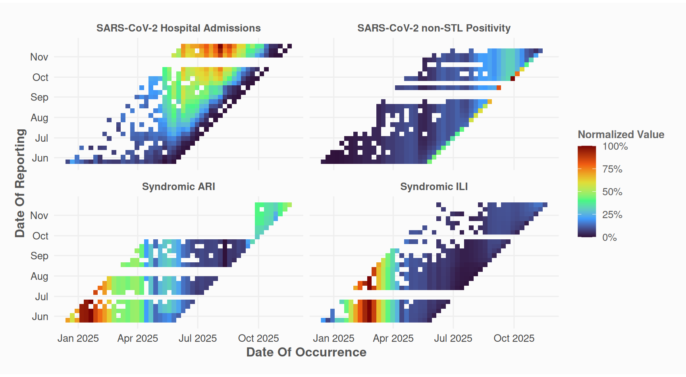
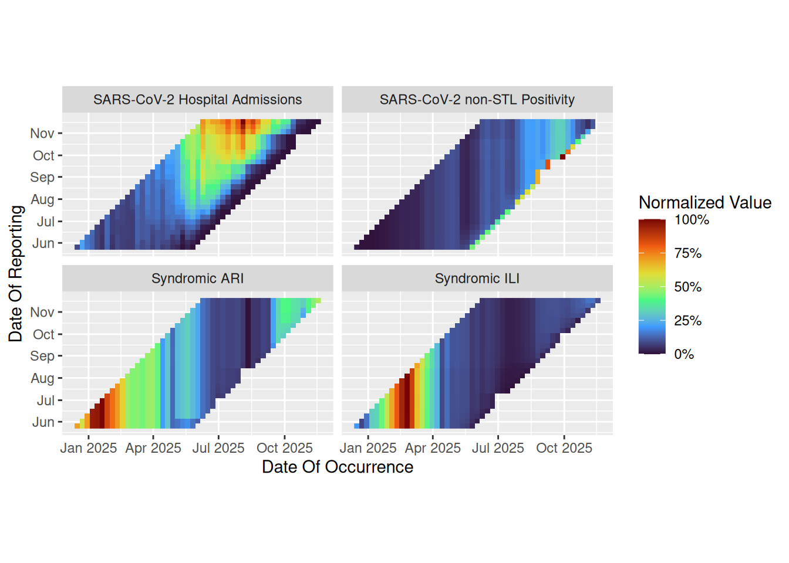
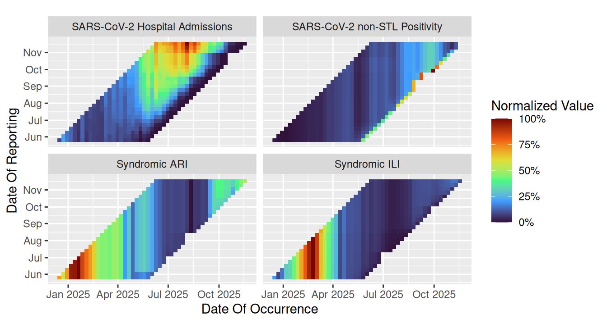
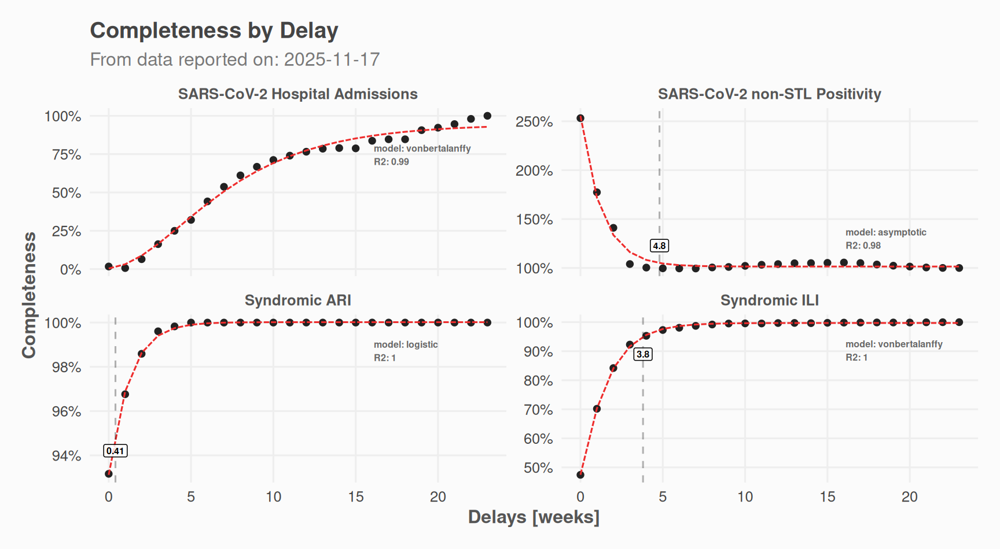
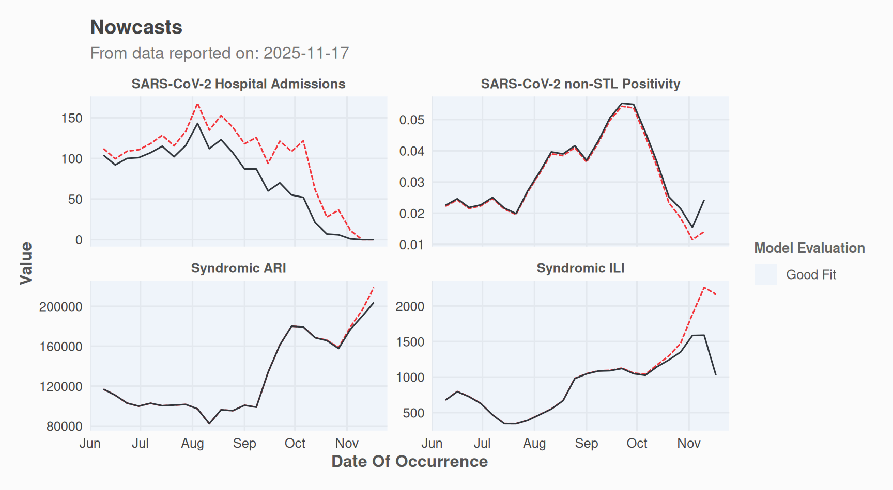
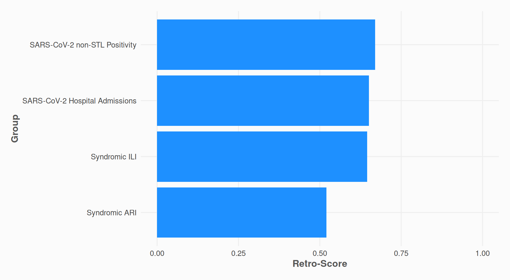

# Getting started

Nowcasting is the process of estimating the current state of a
phenomenon when the data are incomplete due to reporting delays. The
**nowcastr** package implements the chain-ladder method for nowcasting,
supporting both non-cumulative delay-based estimation and model-based
completeness fitting (*e.g.*, logistic or Gompertz curves). This
vignette provides a quick start guide to using the package with demo
data.

## Setup

The package is available on GitHub. Install it with:

``` r

pak::pak("whocov/nowcastr")
```

``` r

library(nowcastr)
```

## Data Structure

Your dataset must contain at least three columns:

- **occurrence date**: when the event happened
- **reporting date**: when the event was reported
- **value**: the observed count/value
- \<*groups*\>: none, one or multiple grouping columns: *e.g.*
  `group_cols = "species"` \# or `group_cols = c("region", "disease")`

The package includes a demo dataset `nowcast_demo` that follows this
structure

``` r

print(nowcast_demo)
#> # A tibble: 1,624 × 4
#>     value date_occurrence date_report group        
#>     <dbl> <date>          <date>      <chr>        
#>  1 251563 2024-12-16      2025-05-26  Syndromic ARI
#>  2 219818 2024-12-23      2025-05-26  Syndromic ARI
#>  3 219815 2024-12-23      2025-06-02  Syndromic ARI
#>  4 253451 2024-12-30      2025-05-26  Syndromic ARI
#>  5 253454 2024-12-30      2025-06-09  Syndromic ARI
#>  6 311660 2025-01-06      2025-05-26  Syndromic ARI
#>  7 311666 2025-01-06      2025-06-02  Syndromic ARI
#>  8 311654 2025-01-06      2025-06-09  Syndromic ARI
#>  9 311657 2025-01-06      2025-06-16  Syndromic ARI
#> 10 313798 2025-01-13      2025-05-26  Syndromic ARI
#> # ℹ 1,614 more rows
```

The demo data also includes a `group` column for demonstrating grouped
processing, though you can have multiple grouping columns.

## Workflow

A typical nowcasting workflow with **nowcastr** involves the following
steps.

### 1. Visualize Input Data

Before nowcasting, inspect the reporting pattern of your data:

``` r

nowcast_demo %>%
  plot_nc_input(
    option = "triangle",
    col_date_occurrence = date_occurrence,
    col_date_reporting = date_report,
    col_value = value,
    group_cols = "group" # use a vector for multiple columns: c("column1", "column2"... )
  )
```



The “millipede” plot provides an alternative view of delays. Each
reporting date is mapped to a distinct line and color.

``` r

nowcast_demo %>%
  plot_nc_input(
    option = "millipede",
    col_date_occurrence = date_occurrence,
    col_date_reporting = date_report,
    col_value = value,
    group_cols = "group"
  )
```



### 2. Prepare Data (Optional)

Depending on your data and use case, you may want to fill missing values
with the last known reported value.

``` r

data_filled <- nowcast_demo %>%
  fill_future_reported_values(
    col_date_occurrence = date_occurrence,
    col_date_reporting = date_report,
    col_value = value,
    group_cols = "group",
    max_delay = "auto"
  )
data_filled %>%
  plot_nc_input(
    option = "triangle",
    col_date_occurrence = date_occurrence,
    col_date_reporting = date_report,
    col_value = value,
    group_cols = "group"
  )
```



This step is optional; `nowcast_cl` can handle unfilled data.

### 3. Run Nowcast

Perform the nowcasting using the chain-ladder method:

``` r

nc_obj <-
  data_filled %>%
  nowcast_cl(
    col_date_occurrence = date_occurrence,
    col_date_reporting = date_report,
    col_value = value,
    group_cols = "group",
    time_units = "weeks",
    # max_delay = 5,
    # max_reportunits = 8,
    do_model_fitting = TRUE
  )
```

The
[`nowcast_cl()`](https://whocov.github.io/nowcastr/reference/nowcast_cl.md)
function returns a `nowcast_results` object containing predictions,
delay distributions, completeness estimates, and parameters.

``` r

S7::prop_names(nc_obj)
#>  [1] "name"         "params"       "time_start"   "time_end"     "n_groups"    
#>  [6] "max_delay"    "data"         "completeness" "delays"       "models"      
#> [11] "results"
```

### 4. Explore Results

Access the different datasets.

``` r

nc_obj@results # Final nowcasted values
#> # A tibble: 95 × 7
#>    group    date_occurrence last_r_date delay value value_predicted completeness
#>    <chr>    <date>          <date>      <dbl> <dbl>           <dbl>        <dbl>
#>  1 SARS-Co… 2025-11-17      2025-11-17      0     0             0        0.00391
#>  2 SARS-Co… 2025-11-10      2025-11-17      1     0             0        0.0316 
#>  3 SARS-Co… 2025-11-03      2025-11-17      2     1            11.4      0.0878 
#>  4 SARS-Co… 2025-10-27      2025-11-17      3     6            36.5      0.164  
#>  5 SARS-Co… 2025-10-20      2025-11-17      4     7            27.8      0.252  
#>  6 SARS-Co… 2025-10-13      2025-11-17      5    21            61.5      0.341  
#>  7 SARS-Co… 2025-10-06      2025-11-17      6    52           122.       0.427  
#>  8 SARS-Co… 2025-09-29      2025-11-17      7    55           109.       0.507  
#>  9 SARS-Co… 2025-09-22      2025-11-17      8    70           121.       0.577  
#> 10 SARS-Co… 2025-09-15      2025-11-17      9    60            93.9      0.639  
#> # ℹ 85 more rows
nc_obj@delays # Summarised completeness values by delay
#> # A tibble: 96 × 5
#>    group                      delay     n completeness_obs completeness_modelled
#>    <chr>                      <dbl> <int>            <dbl>                 <dbl>
#>  1 SARS-CoV-2 Hospital Admis…     0    10          0.0169                0.00391
#>  2 SARS-CoV-2 Hospital Admis…     1    10          0.00670               0.0316 
#>  3 SARS-CoV-2 Hospital Admis…     2    10          0.0646                0.0878 
#>  4 SARS-CoV-2 Hospital Admis…     3    10          0.163                 0.164  
#>  5 SARS-CoV-2 Hospital Admis…     4    10          0.250                 0.252  
#>  6 SARS-CoV-2 Hospital Admis…     5    10          0.321                 0.341  
#>  7 SARS-CoV-2 Hospital Admis…     6    10          0.442                 0.427  
#>  8 SARS-CoV-2 Hospital Admis…     7    10          0.537                 0.507  
#>  9 SARS-CoV-2 Hospital Admis…     8    10          0.611                 0.577  
#> 10 SARS-CoV-2 Hospital Admis…     9    10          0.668                 0.639  
#> # ℹ 86 more rows
nc_obj@completeness # Detailed completeness estimates
#> # A tibble: 2,478 × 8
#>    group         date_occurrence date_report value delay last_value completeness
#>    <chr>         <date>          <date>      <dbl> <dbl>      <dbl>        <dbl>
#>  1 SARS-CoV-2 H… 2025-11-17      2025-11-17      0     0          0        1    
#>  2 SARS-CoV-2 H… 2025-11-10      2025-11-17      0     1          0        1    
#>  3 SARS-CoV-2 H… 2025-11-10      2025-11-10      0     0          0        1    
#>  4 SARS-CoV-2 H… 2025-11-03      2025-11-17      1     2          1        1    
#>  5 SARS-CoV-2 H… 2025-11-03      2025-11-10      0     1          1        0    
#>  6 SARS-CoV-2 H… 2025-11-03      2025-11-03      0     0          1        0    
#>  7 SARS-CoV-2 H… 2025-10-27      2025-11-17      6     3          6        1    
#>  8 SARS-CoV-2 H… 2025-10-27      2025-11-10      2     2          6        0.333
#>  9 SARS-CoV-2 H… 2025-10-27      2025-11-03      0     1          6        0    
#> 10 SARS-CoV-2 H… 2025-10-20      2025-11-17      7     4          7        1    
#> # ℹ 2,468 more rows
#> # ℹ 1 more variable: reportweight <dbl>
```

Plot the results:

``` r

# Delay distribution
plot(nc_obj, which = "delays") +
  ggplot2::labs(
    caption = NULL,
    subtitle = paste0("From data reported on: ", max(data_filled$date_report))
  )
```



``` r


# Nowcast time series
plot(nc_obj, which = "results") +
  ggplot2::labs(
    caption = NULL,
    subtitle = paste0("From data reported on: ", max(data_filled$date_report))
  )
```



Open a Shiny app to explore results group by group:

``` r

nowcast_explore(nc_obj)
```

## How It Works

The chain-ladder method estimates “completeness” for each delay bucket:

- **Delay** = reporting date - occurrence date
- **Completeness** = observed value / last reported value (approximation
  of true value)
- **Average completeness** per delay bucket (across occurrence dates)
- **Nowcast** = observed value / average completeness

Recent occurrence dates have shorter delays and lower completeness. The
method upweights these observations to estimate the true count.

## Other Utility Functions

### Calculate Retro Scores of input data

The retro-score is the ratio of actual value changes to maximum possible
changes \[0-1\].

``` r

# Calculate retro-scores
retroscores <- nowcast_demo %>%
  calculate_retro_score(
    col_date_occurrence = date_occurrence,
    col_date_reporting = date_report,
    col_value = value,
    group_cols = "group"
  )
print(retroscores)
#> # A tibble: 4 × 4
#>   group                          n_changes max_retro_adj retro_score
#>   <chr>                              <dbl>         <dbl>       <dbl>
#> 1 SARS-CoV-2 non-STL Positivity        385           575       0.670
#> 2 SARS-CoV-2 Hospital Admissions       374           575       0.650
#> 3 Syndromic ILI                        371           575       0.645
#> 4 Syndromic ARI                        299           575       0.52
```

``` r

retroscores %>%
  ggplot2::ggplot(ggplot2::aes(y = stats::reorder(group, retro_score), x = retro_score)) +
  ggplot2::geom_bar(stat = "identity", fill = "dodgerblue1") +
  theme_nowcastr() +
  ggplot2::scale_x_continuous(
    limits = c(0, 1),
    # labels = scales::label_percent()
  ) +
  ggplot2::labs(
    y = "Group",
    x = "Retro-Score"
  )
```



### Remove repeated values

This is somewhat the opposite of
[`fill_future_reported_values()`](https://whocov.github.io/nowcastr/reference/fill_future_reported_values.md).

``` r

# Remove duplicate reported values (same value and higher reporting date)
nowcast_demo %>%
  rm_repeated_values(
    col_date_occurrence = date_occurrence,
    col_date_reporting = date_report,
    col_value = value,
    group_cols = "group"
  )
#> # A tibble: 1,624 × 4
#>    value date_occurrence date_report group                         
#>    <dbl> <date>          <date>      <chr>                         
#>  1    12 2024-12-16      2025-05-26  SARS-CoV-2 Hospital Admissions
#>  2    31 2024-12-23      2025-05-26  SARS-CoV-2 Hospital Admissions
#>  3    22 2024-12-30      2025-05-26  SARS-CoV-2 Hospital Admissions
#>  4    21 2024-12-30      2025-06-02  SARS-CoV-2 Hospital Admissions
#>  5    18 2025-01-06      2025-05-26  SARS-CoV-2 Hospital Admissions
#>  6    19 2025-01-06      2025-06-16  SARS-CoV-2 Hospital Admissions
#>  7    11 2025-01-13      2025-05-26  SARS-CoV-2 Hospital Admissions
#>  8     7 2025-01-20      2025-05-26  SARS-CoV-2 Hospital Admissions
#>  9     8 2025-01-20      2025-06-16  SARS-CoV-2 Hospital Admissions
#> 10    17 2025-01-27      2025-05-26  SARS-CoV-2 Hospital Admissions
#> # ℹ 1,614 more rows
```
